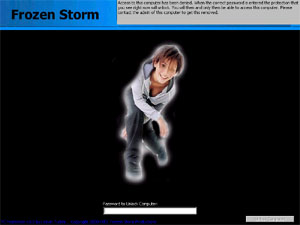



## PC Lockdown 3\.0 \(w/ source\)

### Description

Keep unwanted people off your pC! Disabled ALT+TAB that key on the keyboard that clicks on start, disabled ALT+TAB and this window is always on tob and maximized over the screen. Once you enter the password which is by default "unlock" the bottom right button becomes enabled and is clickable which will enable all the keys and close the program! I am sorry about forgetting the codes to my other programs :*-(
 
### More Info
 

             |
---                |---
**Submitted On**   |2000-12-04 19:35:32
**By**             |[Charles Kevin Tucker](https://github.com/Planet-Source-Code/PSCIndex/blob/master/ByAuthor/charles-kevin-tucker.md)
**Level**          |Advanced
**User Rating**    |4.3 (13 globes from 3 users)
**Compatibility**  |VB 5\.0, VB 6\.0
**Category**       |[Complete Applications](https://github.com/Planet-Source-Code/PSCIndex/blob/master/ByCategory/complete-applications__1-27.md)
**World**          |[Visual Basic](https://github.com/Planet-Source-Code/PSCIndex/blob/master/ByWorld/visual-basic.md)
**Archive File**   |[CODE\_UPLOAD123401242000\.zip](https://github.com/Planet-Source-Code/charles-kevin-tucker-pc-lockdown-3-0-w-source__1-13330/archive/master.zip)

